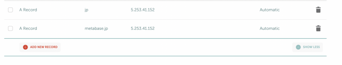
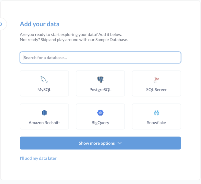
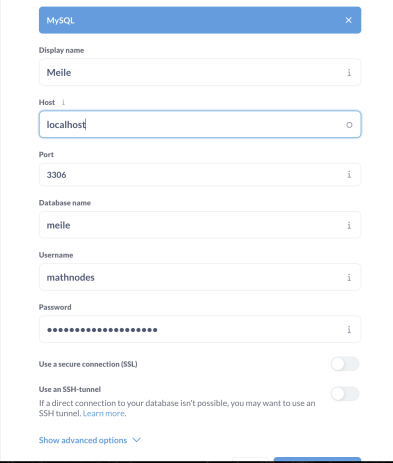
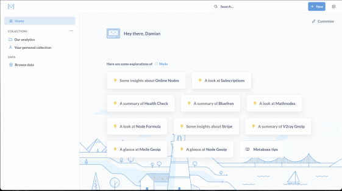
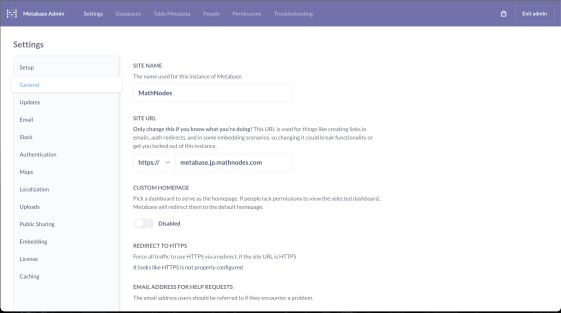
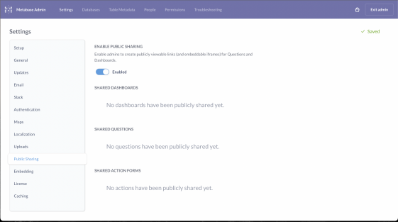
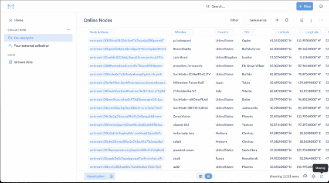
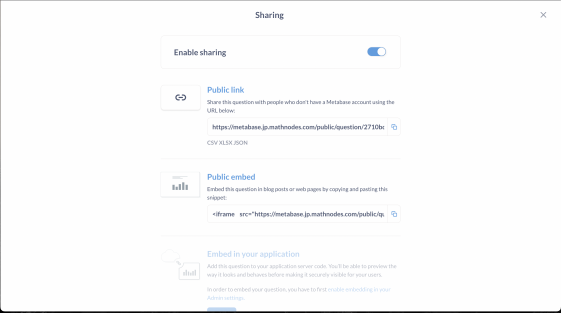

Metabase Install
========================

# Specs

`>=4 vCPU (passmark 2200)`

(cpu passmark/threads)*nVCPU

e.g.

https://www.cpubenchmark.net/cpu.php?cpu=Intel+Xeon+E5-2697A+v4+%40+2.60GHz&id=2814

`>= 8 GB RAM`

`>= 60GB SSD`

# Create user

```
useradd -b /home -c "Meile Metabase Cache" -m -s /bin/bash metabase
```

Give the user a password

```
passwd metabase
```

Add user to sudoers

```
echo "metabase ALL=(ALL:ALL) NOPASSWD: ALL" >> /etc/sudoers
```

# Firewall

```
sudo ufw allow 22/tcp
sudo ufw allow 80/tcp
sudo ufw allow 443/tcp
```

Install iptables-persistent and ufw (if not installed)

```
sudo apt install iptables-persistent ufw
```

# Install MySQL 8.0 Server

```
sudo apt install mysql-server-8.0
```

Run mysql_secure_install

```
mysql_secure_install
```

Set to your preferences

Change root password of mysql user

```
sudo mysql
```

at the command prompt enter the following:

```
ALTER USER 'root'@'localhost' IDENTIFIED WITH mysql_native_password BY 'password';
```

Create mathnodes user:

```
CREATE USER 'mathnodes'@'localhost' IDENTIFIED WITH mysql_native_password BY '565#6w$TATFZDbMXMvPQ';
```

Create metabase databse:

```
CREATE DATABASE metabase;
```

Grant privileges to mathnodes uers on metabase database:

```
GRANT ALTER, REFERENCES, SELECT, INSERT, UPDATE, CREATE, DELETE, LOCK TABLES,SHOW VIEW, EVENT, TRIGGER, DROP,INDEX,CREATE VIEW ON metabase.* TO 'mathnodes'@'localhost';
```

Create meile database

```
CREATE DATABASE meile;
```

Grant privileges to mathnodes user on meile database

```
GRANT ALTER, REFERENCES, SELECT, INSERT, UPDATE, CREATE, DELETE, LOCK TABLES,SHOW VIEW, EVENT, TRIGGER, DROP,INDEX,CREATE VIEW ON meile.* TO 'mathnodes'@'localhost';
```

Flush privileges

```
FLUSH PRIVILEGES;
```

# Create DNS records



Wait an hour for DNS records to propagate

# Run Speedtest

```
wget -O speedtest-cli https://raw.githubusercontent.com/sivel/speedtest-cli/master/speedtest.py
chmod +x speedtest-cli
./speedtest-cli
```

Produce a screenshot of the results

# Install Java Runtime Environment

```
apt install default-jre
```

# Download metabase.tar.gz

```
wget https://mathnodes.com/metabase.tar.gz
```

Extract the archive

```
tar xvjf metabase.tar.bz2
```

Move the metabase jar

```
cd Metabase && mv metabase.jar ..
```

# Install certbot

```
apt install certbot python3-certbot-nginx
```

# Install nginx

```
apt install nginx
```

Make the log directory and give it proper permissions

```
sudo mkdir /var/log/nginx/metabase && sudo chown -R www-data:adm /var/log/nginx/metabase
```

Copy the nginx config file to the proper folder

```
sudo cp /home/metabase/Metabase/nginx/metabase.conf /etc/nginx/conf.d
```

Edit metabase.conf and enter in your domain

i.e.,

```
sudo sed -i 's/foo.bar/metabase.bluefren.xyz/g' /etc/nginx/conf.d/metabase.conf
```

Add firewall rule to allow from ip to ip port 1337

```
sudo ufw allow from `curl -4 icanhazip.com` to `curl -4 icanhazip.com` port 1337
```

# Run certbot

```
sudo certbot run
```

Follow the prompts and be sure to get a cert for the proper domain name

# Edit nginx config file

Add the following lines to `metabase.conf` under `proxy_pass`

```
proxy_set_header   Host $host;
proxy_set_header   X-Real-IP $remote_addr;
proxy_set_header   X-Forwarded-For $proxy_add_x_forwarded_for;
proxy_set_header X-Forwarded-Host $server_name;
proxy_set_header X-Forwarded-Proto https;
```

# Create keystore

Run the keystore script:

```
sudo ./metabase_keystore.sh hostname
```

# Copy service file and start metabase

```
cp /home/metabase/Metabase/metabase.service /etc/systemd/system
```

Copy defaults file

```
sudo cp /home/metabase/Metabase/default/metabase /etc/default
```

Edit your hostname in defaults file

e.g.

```
sudo sed -i 's/foo.bar/metabase.bluefren.xyz/g' /etc/default/metabase
```

Edit your MySQL username and password

```
sudo sed -i 's/username/mathnodes/g' /etc/default/metabase
sudo sed -i 's/password/mathnodes_password/g' /etc/default/metabase
```

Reload system daemons configs and start metabase

```
sudo systemctl daemon-reload && sudo systemctl start metabase.service
```

Make sure metabase start properly

```
sudo journalctl -f -u metabase.service
```

make sure you see a similar line

```
Apr 30 06:47:40 jp.bluefren.xyz metabase[79372]: 2024-04-30 06:47:40,352 INFO metabase.core :: Metabase Initialization COMPLETE in 1.3 mins
```

# Create database cronjobs

Run crontab 

```
crontab -e
```

Select nano

paste the following lines:

```
25 02 * * * /home/metabase/Metabase/Scripts/drop_update_meile.sh "password"
*/12 * * * * /home/metabase/Metabase/Scripts/update_online_nodes.sh "password"                    
```

Where "password" is your MySQL password for the root user

# Add pubkey to authorized_keys

```
vi ~/.ssh/authorized_keys
```

append the follwing

```
# Aimo Koivunen
ssh-ed25519 AAAAC3NzaC1lZDI1NTE5AAAAIB0fGG/z0l/8hkZNMYmti09CvJpIyyZe6UtvivzWx9MH sentinel@aimokoivunen
```

# Submit your cache server

Write to freQniK on Telegram to add your cache server to the deployment

Wait for the upload of the databases and then run the scripts in the cronjobs on the command line

# Configure metabase

Navigate in a browser to https://metabase.foobar.com

Setup your admin account (follow instructions)

Select MySQL



Enter the following information into the screen



## Create the online nodes query



Click on "NEW"->"SQL Question"

Then paste the following:  

```sql
SELECT
  `online_nodes`.`node_address` AS `node_address`,
  `online_nodes`.`moniker` AS `moniker`,
  `online_nodes`.`country` AS `country`,
  `online_nodes`.`city` AS `city`,
  `online_nodes`.`latitude` AS `latitude`,
  `online_nodes`.`longitude` AS `longitude`,
  `online_nodes`.`gigabyte_prices` AS `gigabyte_prices`,
  `online_nodes`.`hourly_prices` AS `hourly_prices`,
  `online_nodes`.`bandwidth_down` AS `bandwidth_down`,
  `online_nodes`.`bandwidth_up` AS `bandwidth_up`,
  `online_nodes`.`wallet` AS `wallet`,
  `online_nodes`.`handshake` AS `handshake`,
  `online_nodes`.`connected_peers` AS `connected_peers`,
  `online_nodes`.`max_peers` AS `max_peers`,
  `online_nodes`.`node_type` AS `node_type`,
  `online_nodes`.`node_version` AS `node_version`,
  `Node Score - Node Address`.`isp_type` AS `isp_type`,
  `Ratings Nodes - Node Address`.`score` AS `score`,
  `Ratings Nodes - Node Address`.`votes` AS `votes`,
  `Node Formula - Node Address`.`formula` AS `formula`
FROM
  `online_nodes`

LEFT JOIN `node_score` AS `Node Score - Node Address` ON `online_nodes`.`node_address` = `Node Score - Node Address`.`node_address`
  LEFT JOIN `ratings_nodes` AS `Ratings Nodes - Node Address` ON `online_nodes`.`node_address` = `Ratings Nodes - Node Address`.`node_address`
  LEFT JOIN `node_formula` AS `Node Formula - Node Address` ON `online_nodes`.`node_address` = `Node Formula - Node Address`.`node`
LIMIT
  1048575
```

Then click "Visualize"

Save the query

## Set the following in the Adminstration settings



Enable public sharing



Go back into the "Online Nodes" query that you just saved

Click the "Sharing" and turn it on



Copy the Public Link



```
https://metabase.jp.mathnodes.com/public/question/2710bd6b-61bc-4bbd-96f2-9d22fd408627
```

Take the UUID of the query (2710bd6b-61bc-4bbd-96f2-9d22fd408627)

and create the following API URL (just by changing your domain and the UUID of the query)

```
https://metabase.jp.bluefren.xyz/api/public/card/2710bd6b-61bc-4bbd-96f2-9d22fd408627/query/json
```

Make sure it works

```
curl -s https://metabase.jp.bluefren.xyz/api/public/card/2710bd6b-61bc-4bbd-96f2-9d22fd408627/query/json
```

You will get a large json output if it works.

Submit this JSON URL to freQniK on Telegram. 

# ALL DONE!